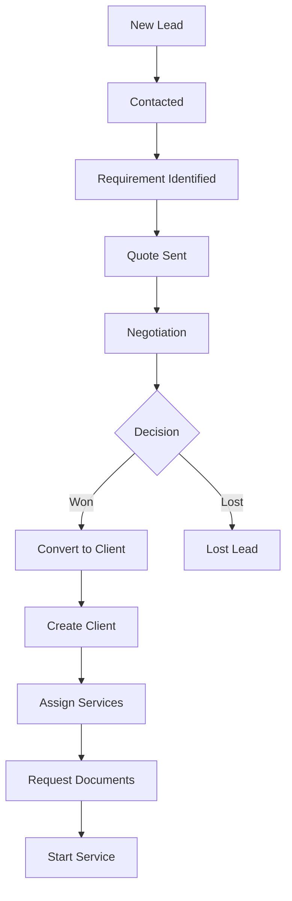
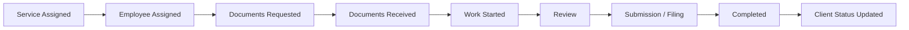
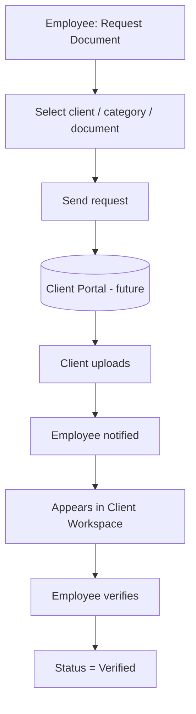

```text
Document: AUDIT_OS_WORKSTATION.md
Scope:    Workstation module — the operational workspace
Status:   SPEC APPROVED FOR BUILD · code not yet applied (see §0.3)
```

# AUDIT OS · WORKSTATION — Module Spec

Workstation is the daily operational workspace of AUDIT OS: it manages the
firm's client-facing work — leads, clients, services, follow-ups and documents.
It attaches to the **existing** AUDIT OS platform as the third primary
destination, replacing the reserved screen at `/workstation`.

`AUDIT_OS_HRMS.md` is the platform spec. This document does not restate it; it
records only what Workstation adds, and every place where the build prompt met
the shipped platform and one of them had to give.

---

## 0. Build contract

### 0.1 What this module does NOT touch

| Untouched | Why |
|---|---|
| HRMS modules (`src/modules/*` except workstation, `src/pages/hrms/*`) | §1 scope lock |
| The main dashboard (`src/pages/Dashboard.tsx`) | Three primary options stay |
| Tools (`src/pages/reserved/Tools.tsx`) | Stays reserved |
| The `Employee`, `Organisation`, `Role`, `Permission`, `Notification`, `AuditLog` tables | One central record each (§3, §17) |
| `tailwind.config.ts` design tokens | §2 — reuse, never redefine |
| Existing HRMS permission codes (`document.read`, `employee.read`, …) | Workstation gets its own `workstation.*` namespace |

### 0.2 Decisions taken before the build

Three requirements in the build prompt contradicted the shipped platform. Each
was put to the product owner and resolved:

**D1 · §14 roles → map onto the existing five.**
§14 names Operations Manager, GST Employee, TDS Employee and Client. The central
`Role` table has exactly `employee · dept_manager · hr_admin · finance_admin ·
md`. Adding role codes would be a permanent change to a table HRMS also reads.

Resolution: **no new role codes, no new `Role` rows.** Workstation adds only new
`workstation.*` permission codes and grants them to existing roles:

| §14 role | Resolves to | Workstation grants |
|---|---|---|
| Super Admin / MD | `md` | all `workstation.*` at `organisation` |
| Operations Manager | `dept_manager` | all `workstation.*` at `organisation` |
| GST Employee | `employee` | assignment-scoped (`self`) |
| TDS Employee | `employee` | assignment-scoped (`self`) |
| Employee | `employee` | assignment-scoped (`self`) |
| Client | *(absent)* | none, ever |

The GST/TDS distinction is **not** a role — it is
`ClientService.assignedEmployeeId` plus `GstProfile.assignedEmployeeId`. This
satisfies §20's "GST/TDS employees see only their assigned clients/services"
correctly, because that scope was always assignment-derived rather than
role-derived. `hr_admin` and `finance_admin` receive **zero** Workstation
grants — §14 does not list them.

*Deferred:* §55 hands invoicing to Finance after conversion. When that lands,
`finance_admin` will likely need `workstation.client.read` at `organisation`.
**[DECIDE later — not granted now.]**

**D2 · Seed against the existing eight employees.**
The prompt's examples name "Rahul Kumar · GST Executive", who does not exist.
Rather than append people to the central `Employee` table — which would change
what HRMS Employees, Attendance, Payroll and Reports display — every Workstation
assignment references an employee already seeded:

| Employee ID | Name | Workstation role in the seed |
|---|---|---|
| `emp-mgr` | Vikram Shetty | Account Manager / service manager (the prompt's "Operations Manager") |
| `emp-exec` | Meera Iyer | GST-side executive (the prompt's "Rahul") |
| `emp-articled` | Karthik Subramanian | TDS / IT filing executive |
| `emp-probation` | Divya Menon | Bookkeeping / document collection |
| `emp-md` | Ravi Krishnan | Escalation, sees everything |

`emp-hr`, `emp-fin` and `emp-inactive` are never assigned Workstation work.

**D3 · Build both API layers, depth-first per module.**
The repo ships two live API layers behind one contract: MSW handlers (mock mode,
the default) and Express + Prisma. A module is **not done** until both answer
identically and its UI is complete. Order is fixed by §0: Dashboard → Leads →
Clients → Services → Follow-ups → Documents.

### 0.3 How changes are applied (§65)

No file in the working tree is modified until the change set is previewed and
explicitly approved. The build runs in an **isolated git worktree**, so the
running application is untouched and reviewable side by side:

```
User request → build in worktree → preview (runnable app + file-level diff)
   ├── APPROVE → merge into the working tree
   └── REJECT  → discard the worktree; working tree never changed
```

`ExitWorktree` without merge is the undo path of §65.3. Schema, RBAC and API
changes are called out individually in the preview, per §65.5.

---

## 1. Deliverables

| # | Deliverable | Definition of done | Status |
|---|---|---|---|
| 1 | This spec | Covers §§1–21 of the prompt, with the §18 diagrams | ✓ done |
| 2 | Workstation shell + sidebar | Replaces the reserved screen; nav renders from permissions | pending approval |
| 3 | Data layer — schema + seed | All §17 entities; one central Client record; seeded per §19 | pending approval |
| 4 | RBAC enforced server-side | §14 matrix passes §20's tests in **both** API layers | pending approval |
| 5 | Modules, in §0 order | Dashboard → Leads → Clients → Services → Follow-ups → Documents | pending approval |
| 6 | Demo walkthrough | Lead → Client → Service → Document runs end to end, no dead click | pending approval |

---

## 2. Platform reuse — the inheritance list

Nothing below is re-implemented. Workstation consumes it as-is.

| Concern | Reused primitive |
|---|---|
| Response envelope | `{ data }` / `{ error: { code, message, details? } }` — `src/services/api.ts`, `server/src/lib/http.ts` |
| Auth | JWT in an httpOnly `SameSite=Lax` cookie; `authenticate` mounted once in `app.ts` |
| Authorize | `requirePermission(code, scope)` + `widestScope()` — `server/src/platform/auth.ts`, `scope.ts` |
| Mock chain | `withAuth` / `withScope` — `src/data/mock/middleware.ts` |
| Serialization | camelCase DB ↔ snake_case API happens **only** in `server/src/api/serialize.ts` |
| Money | Integer paise everywhere; `inr()` renders `₹1,25,000` |
| Calendar dates | `YYYY-MM-DD` **strings** for due dates / filing periods; `DateTime` (UTC) for points in time |
| Notifications | `notifyEmployee()` / `notifyUser()` — `server/src/platform/notify.ts` |
| Audit | `writeAudit()` — append-only `AuditLog` |
| Signed files | `signedLink()` / `verifyResourceToken()` — HMAC + expiry, never a guessable path |
| Design tokens | `tailwind.config.ts` — warm neutrals, one gold, 2px left-border status, 4px radius, 40px rows |
| Dashboard widgets | `registerWidget()` — `src/platform/dashboard/registry.ts` |

### 2.1 Design rules restated as build constraints

- Status is a **2px left border + text weight**. `StatusRow` / `StatusLabel`
  from `src/components/StatusRow.tsx`. No filled pills anywhere in Workstation.
- **One gold element per screen.** In every Workstation list that is the primary
  action button (*Add Lead*, *Add Client*, *New Follow-up*, *Request Document*)
  and nothing else. The active sidebar bar is gold but belongs to the shell, not
  the screen.
- `tabular-nums` is inherited from `body`; every Client ID, Lead ID, GSTIN,
  amount, date and time renders with it. No per-component wiring.
- Illegal utilities cannot compile — `colors`, `borderRadius` and `boxShadow` are
  **replaced** in the Tailwind config, so `gradient`, `shadow-lg`, `rounded-xl`,
  `blur`, `purple/indigo/violet` are not emitted classes. §20's grep passes by
  construction.

---

## 3. Core data architecture

**One central `Client` record.** One company, one row, one human-readable
`CLI-####`. Leads, Services, Follow-ups, Documents, GST, E-way Bills, Tasks and
Activity all reference that one id. Nothing creates a second client row.

```
LEAD → conversion → CLIENT → SERVICES → TASKS / FOLLOW-UPS → DOCUMENTS → COMPLIANCE / SERVICE STATUS
```

Four corollaries enforced in code, not by convention:

1. **`Lead.convertedClientId` is `@unique`.** The database itself refuses a
   second client from one lead. Conversion runs inside a transaction that
   re-reads the lead `FOR UPDATE`; a double-submit gets `409 already_converted`.
2. **A converted lead is never deleted.** Conversion sets
   `convertedClientId` + `convertedAt` and leaves everything else intact.
   `Client.sourceLeadId` points back. There is no delete path to `Lead`.
3. **One `FollowUp` table serves leads and clients.** `leadId` and `clientId`
   are both nullable; exactly one is set, enforced at write time and by a check
   in the seed verifier. There is no second follow-up system.
4. **Documents hang off the client, never the service.** `ClientDocument.clientId`
   is required; `clientServiceId` is an optional *tag*. There is no per-service
   document store.

Employee attributes are never copied. Every assignment is an `employeeId` FK and
is joined at read time through the existing `employeeRef()` serializer.

---

## 4. Information architecture

```
WORKSTATION
  • Dashboard      ← the Workstation overview, NOT the main AUDIT OS dashboard
  • Leads
  • Clients
  • Follow-ups
  • Services
  • Documents
```

Routes:

| Route | Screen |
|---|---|
| `/workstation` | Workstation Dashboard (§5) |
| `/workstation/leads` · `/leads/:id` | Lead list · Lead detail |
| `/workstation/clients` · `/clients/:id/:tab?` | Client list · Client Workspace |
| `/workstation/services` | Service list |
| `/workstation/follow-ups` | Follow-up list |
| `/workstation/documents` | Document list (client-grouped) |
| `/workstation/search` | Global Workstation search results |

Client Workspace tabs are **nested route segments**, not local state, so a tab is
deep-linkable and the breadcrumb reads correctly:
`overview · details · services · gst · eway · documents · follow-ups · tasks · activity`.

Sidebar behaviour is the shell's existing `TopItem` contract, unchanged:
one section expands at a time, active item = 2px gold left bar only, 48px
collapsed rail, collapse state persists. Workstation stops rendering as
`reserved` and gains permission-filtered sub-items. Tools stays reserved.

A role with no `workstation.access` grant (`hr_admin`, `finance_admin`) sees no
Workstation section at all — a visible entry to a screen that answers 403 is the
dead click §20 forbids.

### 4.1 Entity relationships

```
Lead ─(conversion)→ Client ──┬── ClientContact
                             ├── ClientService ── Task
                             ├── GstProfile ── GstFiling
                             ├── EwayBill
                             ├── FollowUp
                             ├── ClientDocument ── ClientDocumentVersion
                             └── Activity
Employee ── Lead / Client / ClientService / FollowUp / Task
FollowUp → Lead XOR Client
ClientDocument / ClientService → Client
```

---

## 5. Data model

Fourteen new Prisma models. All are additive; no existing model changes shape.

| Model | Purpose | Key columns |
|---|---|---|
| `Service` | Configurable service catalog | `code`, `name`, `isActive`, `sortOrder` |
| `Lead` | Pre-client prospect | `leadCode` **@unique** `LD-####`, `serviceId`, `priceQuotedPaise`, `assignedEmployeeId`, `status`, `convertedClientId` **@unique** |
| `Client` | **The one central record** | `clientCode` **@unique** `CLI-####`, `companyName`, `gstin`, `pan`, `tan`, `accountManagerId`, `status`, `sourceLeadId` **@unique**, `portalEnabled` |
| `ClientContact` | Additional contacts | `clientId`, `isPrimary` |
| `ClientService` | A service sold to a client | `clientId`, `serviceId`, `assignedEmployeeId`, `managerId`, `dueDate`, `status` |
| `Task` | Work inside a service | `clientId`, `clientServiceId?`, `assignedEmployeeId`, `dueDate`, `status` |
| `FollowUp` | **One entity, leads + clients** | `leadId?` XOR `clientId?`, `type`, `scheduledAt`, `assignedEmployeeId`, `status`, `completedByEmployeeId` |
| `DocumentCategory` | GST · IT Filing · Basic · Other | `code`, `name`, `sortOrder` |
| `ClientDocument` | Client-centric document | `clientId` **required**, `categoryId`, `clientServiceId?`, `financialYear`, `status`, `currentVersion` |
| `ClientDocumentVersion` | v1 → v2 → v3 | `documentId`, `version`, `fileKey`, `uploadedBy`, `previousVersionId?` |
| `GstProfile` | One per client | `clientId` **@unique**, `gstin`, `registrationStatus`, `filingFrequency`, `assignedEmployeeId` |
| `GstFiling` | One return period | `gstProfileId`, `period` `YYYY-MM`, `returnType`, `status`, `filedAt`, `arn` |
| `EwayBill` | Simulated e-way bill | `clientId`, `ewbNo`, `status`, `isSimulated` **default true** |
| `Activity` | Lead/Client timeline | `subjectType` (`lead`\|`client`), `subjectId`, `action`, `actorUserId`, `createdAt` |

Every table carries `createdAt · updatedAt · createdBy · updatedBy · deletedAt`,
matching the platform's soft-delete convention. `Activity` is append-only and
carries no `deletedAt`, like `AuditLog`.

**Naming deviation from §17, deliberate:** §17 calls them `Document`,
`DocumentVersion`. The schema already has `EmployeeDocument` for HRMS, and a bare
`Document` next to it invites exactly the confusion §3 is trying to prevent.
They are named `ClientDocument` / `ClientDocumentVersion` so the client-centric
rule is legible at every call site. `DocumentCategory` keeps its §17 name.

### 5.1 Enumerated states

```
Lead.status       new · contacted · requirement_identified · quote_sent
                  negotiation · won · lost
Client.status     active · onboarding · pending_documents · service_due · inactive
ClientService     not_started · documents_pending · in_progress · under_review
.status           ready · submitted · completed · failed · on_hold
FollowUp.type     call · whatsapp · email · meeting · document_request
                  payment_followup · service_followup · other
FollowUp.status   pending · completed · rescheduled · cancelled · missed
Document.status   requested · pending · uploaded · under_review · verified
                  rejected · expired
GstFiling.status  not_started · documents_pending · data_preparation
                  under_review · ready_to_file · filed · failed · completed
EwayBill.status   generated · active · cancelled · expired
```

Lead transitions are validated server-side against an explicit adjacency map —
an illegal jump is `422 invalid_transition`, not a silent write:

```
new            → contacted, lost
contacted      → requirement_identified, lost
requirement_…  → quote_sent, lost
quote_sent     → negotiation, won, lost
negotiation    → won, lost
won            → (terminal; conversion only)
lost           → (terminal; reopen = contacted, audited)
```

### 5.2 System-generated fields

`Lead.createdAt` is set by the database default and **never** appears in a
create or update payload. The API strips it from any body that carries it; the
form renders it read-only as `Created: 06 Sep 2026 10:32 AM`. Same for
`Client.clientCode` and `Lead.leadCode`, which are allocated by a server-side
counter inside the creating transaction — never by the client, never by
`count() + 1` outside a transaction.

---

## 6. Permissions

Eighteen new codes, all namespaced. None collide with an HRMS code.

```
workstation.access
workstation.lead.read        workstation.lead.manage      workstation.lead.convert
workstation.client.read      workstation.client.manage
workstation.service.read     workstation.service.manage
workstation.followup.read    workstation.followup.manage
workstation.document.read    workstation.document.manage  workstation.document.verify
workstation.gst.read         workstation.gst.manage
workstation.eway.read        workstation.eway.generate    workstation.eway.cancel
```

| Role | Grants |
|---|---|
| `md` | all eighteen at `organisation` |
| `dept_manager` | all eighteen at `organisation` |
| `employee` | `access`, `lead.read/manage`, `client.read`, `service.read/manage`, `followup.read/manage`, `document.read/manage`, `gst.read/manage`, `eway.read/generate` — all at `self` |
| `hr_admin` | none |
| `finance_admin` | none |

`employee` does **not** get `lead.convert`, `client.manage`, `document.verify` or
`eway.cancel`. Converting a lead, editing the central client record, verifying a
document and cancelling an e-way bill are supervisory acts.

### 6.1 What `self` scope means here

For HRMS, `self` means "my own row". For Workstation it means **"rows assigned to
me"**, resolved by one shared helper — `assignedClientIds(session)` — and folded
into the Prisma `where` / mock filter *before* the query runs. Never a
post-fetch filter.

```
assignedClientIds(me) =
    Client.accountManagerId = me
  ∪ ClientService.assignedEmployeeId = me → clientId
  ∪ ClientService.managerId          = me → clientId
  ∪ GstProfile.assignedEmployeeId    = me → clientId
```

| Entity | `self` predicate |
|---|---|
| Lead | `assignedEmployeeId = me` |
| Client | `id ∈ assignedClientIds(me)` |
| ClientService | `assignedEmployeeId = me OR managerId = me` |
| FollowUp | `assignedEmployeeId = me OR clientId ∈ assignedClientIds(me) OR leadId ∈ myLeadIds` |
| ClientDocument · GstProfile · GstFiling · EwayBill · Task · Activity | `clientId ∈ assignedClientIds(me)` |

A caller outside scope gets **403** — never a `200 { items: [] }`, never a `404`.
That holds for the detail route (`GET /api/clients/:id`) as much as the list.

---

## 7. Screens

### 7.1 Workstation Dashboard (module 1)

KPI cards: Total Leads · New Leads · Active Clients · Follow-ups Today ·
Pending Follow-ups · Active Services · Pending Documents · Services Due Soon.

Lead pipeline, counts per stage, `NEW → CONTACTED → REQUIREMENT IDENTIFIED →
QUOTE SENT → NEGOTIATION → WON / LOST`.

Today's follow-ups: Lead/Client · contact · service · time · assignee · status.
Client summary: New · Active · Pending documents · Services due · Requiring
follow-up — each row opens the Client Workspace.

Served by one aggregate endpoint, `GET /api/workstation/dashboard`, scoped like
every other route. It is **not** the main AUDIT OS dashboard and does not touch
`src/pages/Dashboard.tsx`. The platform widget registry is separately available;
Workstation registers nothing into it in this phase, so the main dashboard is
byte-identical.

### 7.2 Leads (module 2)

List columns: **Lead ID · Name · Contact · Service · Price Quoted · Date/Time ·
Status · Assigned To · Actions**.

Form fields: Name*, Contact Number* (validated), Service Required (searchable),
Price Quoted (₹), Assigned To (HRMS `Employee` picker), Notes. Created date/time
shown read-only.

Actions, each writing an `Activity` row: Edit · Change Status · Add Follow-up ·
Add Note · Assign Employee · **Convert to Client** · Mark Lost.

Detail page = Lead Information + Activity Timeline.

**Conversion** (`POST /api/leads/:id/convert`), one transaction:
requires `status = won` (else `422`) and `convertedClientId = null` (else `409`);
allocates `CLI-####`; creates `Client` + primary `ClientContact` + one
`ClientService` from the lead's service, assignee and due date; back-links
`Lead.convertedClientId` / `Client.sourceLeadId`; writes `lead.converted` and
`client.created` activities; notifies the account manager; returns the new client
so the UI can offer **Open Client**. The lead row survives untouched otherwise.

The confirmation dialog shows lead name, contact, service and price quoted
before anything is written.

### 7.3 Clients (module 3)

List columns: **Client ID · Company · GSTIN · Services · Account Manager ·
Status · Documents · Actions**. Search by company / Client ID / GSTIN / contact
person / contact number. Filters: status · service · assigned employee · GST
status · pending documents · follow-up status.

**Client Workspace** header: company name, then Client ID · GSTIN · PAN ·
primary contact · number · email · Account Manager · status. Nine tabs, listed
in §4. Each tab is permission-gated; a tab the caller cannot read is not
rendered *and* its endpoint answers 403.

- **Overview** — status + active services, each with status, assignee, next due
  date, last completed activity.
- **Company Details** — Basic / Tax / Internal, as §7.6.
- **GST** — GSTIN, registration status, filing status, last filing, next due,
  assigned employee. Filings list: period · return type · status · filing date ·
  assignee · remarks.
- **E-way Bills** — service availability, connection status, recent bills,
  pending actions. Generate · View · Update · Cancel · Search · History, all
  permission-gated. **Simulated**: every response is generated locally, `isSimulated`
  is stored on the row, and the tab carries a permanent notice —
  *"Simulated — Audit OS is not connected to the government e-way bill system."*
  **[VERIFY: real e-way API contract before go-live.]**

### 7.4 Services (module 4)

List: **Service · Client · Assigned To · Status · Due Date · Last Updated**.
Filters: service type · client · employee · status · due date.
Assignment carries an assignee, a manager and a due date.
Each stage transition writes an `Activity` row:

```
Assigned → Employee Assigned → Documents Requested → Documents Received
  → Work Started → Review → Submission/Filing → Completed → Client Status Updated
```

The final step updates `Client.status` in the same transaction, so "client status
updated" is a consequence of the service completing, not a separate chore.

### 7.5 Follow-ups (module 5)

One list over both leads and clients: **Follow-up · Lead/Client · Contact ·
Service · Date · Time · Assigned To · Status**. Filters: Today · Upcoming ·
Overdue · Employee · Status.

Reminders emit into the platform `Notification` primitive via `notifyEmployee()`
— *"Follow-up with ABC Pvt Ltd in 30 minutes"* — and are labelled as scheduled
in-app only; no SMS or email transport exists yet, and the UI says so.

Completion (`POST /api/follow-ups/:id/complete`) records completed-by,
completion time and notes, and writes an activity row on the parent lead/client.

### 7.6 Documents (module 6)

Structure is `Client → Category → Document`. Four seeded categories: **GST · IT
Filing · Basic / Company Details · Other**. Fields: Document ID · Client · File
name · Category · Service · Financial Year · Uploaded by · Upload date ·
Version · Status.

**Versioning never overwrites.** An upload against an existing document inserts a
new `ClientDocumentVersion` at `currentVersion + 1`, linked to its predecessor.
Every version stays downloadable through its own signed URL.

**Request flow — the Client Portal handoff (§49, §56).** Modelled, not built:

```
Employee: Request Document → client + category + required document
  → send request → [Client Portal — future] → client uploads
  → employee notified → appears in Client Workspace → verify → VERIFIED
```

`POST /api/clients/:id/documents` with `status: requested` creates the request
row and an activity entry. Because no portal exists, the UI states plainly:
*"Client Portal is not yet available. This request is recorded in Audit OS; no
message has been sent to the client."* The seed includes a document whose
`uploadedBy` is `portal`, so the receiving path is exercised and the eventual
portal attaches without a redesign. **No client-facing screen is built.**

`Client.portalEnabled` and `portalInviteEmail` exist unused, so enabling the
portal later is a data change, not a migration.

---

## 8. API contract

Every route: `authenticate → authorize(permission, scope) → validate → handle →
activity/audit`. Codes `400 · 401 · 403 · 404 · 409 · 422 · 429`.

```
LEADS
GET   /api/leads                  POST  /api/leads
GET   /api/leads/:id              PATCH /api/leads/:id
POST  /api/leads/:id/follow-up    POST  /api/leads/:id/convert
GET   /api/leads/:id/activity

CLIENTS
GET   /api/clients                POST  /api/clients
GET   /api/clients/:id            PATCH /api/clients/:id
GET   /api/clients/:id/activity   GET   /api/clients/:id/tasks

CLIENT SERVICES
GET   /api/clients/:id/services   POST  /api/clients/:id/services
GET   /api/services               PATCH /api/services/:id
GET   /api/service-catalog

FOLLOW-UPS
GET   /api/follow-ups             POST  /api/follow-ups
PATCH /api/follow-ups/:id         POST  /api/follow-ups/:id/complete

DOCUMENTS
GET   /api/clients/:id/documents  POST  /api/clients/:id/documents
PATCH /api/documents/:id          POST  /api/documents/:id/verify
POST  /api/documents/:id/versions GET   /api/documents/:id/download?t=

GST
GET   /api/clients/:id/gst        GET   /api/clients/:id/gst/filings
PATCH /api/gst/filings/:id

E-WAY   (simulated — every response carries is_simulated: true)
GET   /api/clients/:id/eway       POST  /api/clients/:id/eway/generate
POST  /api/eway/:id/cancel

WORKSTATION
GET   /api/workstation/dashboard  GET   /api/workstation/search?q=
```

`GET /api/workstation/search?q=` scopes **before** results leave the server and
returns them grouped: `{ leads: [], clients: [], services: [], follow_ups: [],
documents: [] }`. Searching "ABC Pvt Ltd" returns the client and its services,
documents and follow-ups — and returns nothing at all from a client the caller
is not assigned to.

---

## 9. Security

- Authorization is server-side on every route, in **both** API layers. The mock
  middleware is the API in mock mode, so `withScope` is a real control there.
- Out of scope ⇒ **403**. Never a `200` with an empty array, never a `404`.
  Verified per entity by `scripts/verify-workstation.mjs`.
- Files are served through short-lived HMAC-signed URLs via the existing
  `signedLink()` — no guessable public path, per-version.
- Anything simulated says so, in the UI, at the point of use: e-way bill
  generation and cancellation, the document-portal request, follow-up reminder
  transport.
- Price Quoted is never written to `LedgerTransaction` and never described as a
  payment. The Lead detail labels it *"Quoted — not an invoice. Billing is
  handled in Accounts."*

---

## 10. Seed data (§19)

Against the eight existing employees, per D2.

| Set | Contents |
|---|---|
| Services | 9 catalog rows: GST Filing · GST Registration · TDS · Income Tax Filing · E-way Bill · E-invoice · Bookkeeping · Company Incorporation · Other |
| Leads | 20 — new 4 · contacted 3 · requirement identified 2 · quote sent 2 · negotiation 1 · **won 5 (all converted)** · lost 3 |
| Clients | 12 with unique `CLI-1001…1012`; 5 carry `sourceLeadId`, 7 pre-date the lead pipeline; mixed statuses; real GSTIN/PAN shapes |
| ClientServices | ~26 spanning all nine statuses; some due soon, some overdue |
| Follow-ups | ~18 across leads **and** clients — Today, Upcoming, Overdue, plus completed and missed |
| GST | 9 `GstProfile` + ~30 `GstFiling` across Filed / Pending / Documents Pending |
| E-way | ~12 simulated bills, incl. one cancelled |
| Documents | ~40 across all four categories; ≥1 with three versions; statuses incl. Requested and Verified; one `uploadedBy: portal` |
| Activity | Timelines that reconcile exactly with the above — every conversion, assignment and upload has its row |

The seed is generated by a shared builder consumed by **both** `src/data/seed/workstation/*`
(mock) and `server/prisma/seed.ts` (Prisma), so the two modes show the same
dataset rather than drifting.

---

## 11. Workflow diagrams

**Lead → Client**



**Service lifecycle**



**Document request**



---

## 12. File plan

New unless marked. Nine files are modified; each modification is additive.

```
server/prisma/schema.prisma                    MODIFIED  +14 models, 0 changed
server/prisma/seed.ts                          MODIFIED  + workstation section
server/src/api/serialize.ts                    MODIFIED  + 14 *ToApi functions
server/src/platform/rbac/matrix.ts             MODIFIED  + 18 codes, + grants
server/src/app.ts                              MODIFIED  + 8 router mounts
server/src/platform/workstation/scope.ts       new  assignment scope resolver
server/src/platform/workstation/activity.ts    new  activity writer
server/src/platform/workstation/codes.ts       new  LD-####/CLI-#### allocation
server/src/modules/workstation/*.routes.ts     new  leads, clients, services,
                                                    followups, documents, gst,
                                                    eway, dashboard, search

src/data/models.ts                             MODIFIED  + workstation types
src/platform/rbac/matrix.ts                    MODIFIED  + 18 codes, + grants
src/data/mock/db.ts                            MODIFIED  + collections, key v10
src/data/mock/handlers/index.ts                MODIFIED  + registration
src/data/seed/workstation/*.ts                 new  shared seed builder
src/data/mock/handlers/workstation/*.ts        new  mirrors the Express routes

src/modules/workstation/api.ts                 new  typed API client
src/modules/workstation/components/*           new  table, filters, drawers
src/modules/workstation/{leads,clients,services,followups,documents}/*   new
src/pages/workstation/*                        new  7 route components
src/App.tsx                                    MODIFIED  + routes
src/shell/Sidebar.tsx                          MODIFIED  Workstation section
src/shell/TopBar.tsx                           MODIFIED  breadcrumb labels only
src/pages/reserved/Workstation.tsx             DELETED   replaced by the module
scripts/verify-workstation.mjs                 new  §20 acceptance checks
```

### 12.1 Shell changes, in full

Only two, both small, both called out because they touch files HRMS also uses:

1. `Sidebar.tsx` — `Workstation` stops passing `reserved` and gains a
   `subItems` array filtered by `can(role, 'workstation.*')`, exactly like the
   existing HRMS block. The `TopItem` component itself is unchanged. Tools keeps
   `reserved`.
2. `TopBar.tsx` — three entries added to the existing `acronyms` map in
   `titleCase()` so the breadcrumb reads `GST`, `E-way Bills`, `Follow-ups`
   instead of `Gst`, `Eway`, `Follow ups`. No other change.

The dead ⌘K *Search* button in the top bar is **left alone**. Wiring it would
change global shell behaviour for HRMS users, which §21 forbids; Workstation's
§13 search is reached from within Workstation instead.
**[DECIDE: wire the global ⌘K bar to Workstation search in a later pass?]**

---

## 13. Acceptance criteria (§20)

Automated by `scripts/verify-workstation.mjs`, in the shape of the existing
`scripts/verify-*.mjs`.

**Scope & platform**
- [ ] Main dashboard renders exactly HRMS · Workstation · Tools; none redesigned
- [ ] `git diff` touches no HRMS module, page or handler
- [ ] Workstation replaces the reserved screen; sidebar renders from permissions
- [ ] No second employee table; every assignment is an `Employee` FK
- [ ] No second dashboard route

**Data integrity**
- [ ] One `Client` per company; `clientCode` unique; zero duplicates created by
      leads, services, documents or follow-ups
- [ ] Converting a won lead creates a client and preserves the lead
- [ ] A second convert on the same lead returns `409`
- [ ] One `FollowUp` table serves both; exactly one of `leadId`/`clientId` set
- [ ] No document exists without a `clientId`
- [ ] `Lead.createdAt` rejects a client-supplied value

**Functional**
- [ ] Modules complete in §0 order; no dead button, link or route
- [ ] Every form validates client- *and* server-side with field-level messages
- [ ] Every §6.6 / §8.4 action appends an `Activity` row
- [ ] The §18 lead → client → service → document flow runs end to end
- [ ] Every list has loading, empty, error and permission-denied states

**Security / RBAC**
- [ ] An unassigned client returns **403** — asserted for list *and* detail, in
      both API layers
- [ ] An `employee`-role user sees only assigned clients and services
- [ ] `hr_admin` / `finance_admin` get 403 on every `/api/workstation` route and
      see no Workstation nav
- [ ] E-way and document-portal actions are labelled simulated; no connectivity
      claim anywhere in the source
- [ ] Downloads require a valid signed token

**Design**
- [ ] `grep -rE 'gradient|shadow-lg|rounded-(xl|2xl)|blur|purple|indigo|violet' src/`
      returns nothing
- [ ] Status uses the 2px left border; no filled pills
- [ ] One gold element per screen; `tabular-nums` on all figures/dates/IDs
- [ ] Renders at 1440 / 1024 / 768 / 375; no console errors
- [ ] `npm run type-check` and `type-check:api` clean; no `any` in service/API layers

---

## 14. Open items

| # | Item | Status |
|---|---|---|
| 1 | Real e-way bill API contract and credentials | **[VERIFY]** before go-live; simulated and labelled until then |
| 2 | Real GST filing / GSTN connectivity | Out of scope; status is recorded manually |
| 3 | `finance_admin` read access to clients for invoicing (§55) | **[DECIDE]** deferred; no grant now |
| 4 | Wiring the global ⌘K bar to Workstation search | **[DECIDE]** deferred; §21 scope discipline |
| 5 | Client Portal | Modelled only (`portalEnabled`, `uploadedBy: portal`); no client-facing screen |
| 6 | Document file storage | Metadata + signed URL only, matching HRMS documents today |
